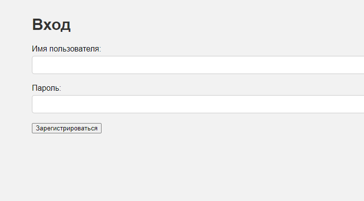

# Отчет по десятой лабораторной работе

1. [Инструкции по запуску проекта](#1-инструкции-по-запуску-проекта).
2. [Описание проекта](#2-описание-проекта).
3. [Примеры использования проекта с приложением скриншотов или фрагментов кода](#3-пример-использования-проекта-с-приложением-скриншотов).
5. [Список использованных источников](#5-список-использованных-источников).

## 1. Инструкции по запуску проекта

Данные инструкции действительны при использовании PhpStorm, в ином случае, воспользуйтесь приведенной ссылкой:
[запуск проекта с gitHub](https://www.youtube.com/watch?v=6N6JFynR0gM)

1. Клонируйте репозиторий:
   ```bash
   https://github.com/Artiom9/php_labs.git
2. Запустите проект:
   <!-- Если у вас есть веб-сервер (например, Apache или Nginx), настройте его так, чтобы корневой каталог указывал на
   каталог вашего проекта.  
   Если у вас нет веб-сервера, вы можете использовать встроенный сервер PHP для тестирования: -->
   ```bash 
   php -S localhost:8000 lab_10\lab10.php

## 2. Описание проекта

Проект представляет собой веб-приложение для проведения городских мероприятий. Платформа позволяет гражданам узнавать и записываться на мероприятия.

## 3. Пример использования проекта (с приложением скриншотов)





## 5. Список использованных источников

1. [Функции в PHP](https://www.php.net/manual/ru/functions.user-defined.php)
2. [MySQL](https://dev.mysql.com/doc/)