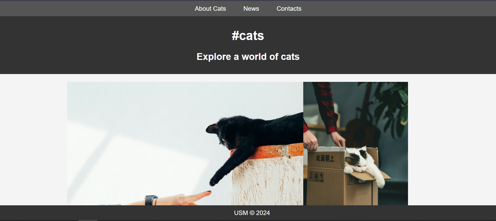

# Отчет по третьей лабораторной работе

1. [Инструкции по запуску проекта](#1-инструкции-по-запуску-проекта).
2. [Описание проекта](#2-описание-проекта).
3. [Краткая документация к проекту](#3-краткая-документация-к-проекту).
4. [Примеры использования проекта с приложением скриншотов или фрагментов кода](#4-пример-использования-проекта-с-приложением-скриншотов).
5. [Список использованных источников](#5-список-использованных-источников).

## 1. Инструкции по запуску проекта

Данные инструкции действительны при использовании PhpStorm, в ином случае, воспользуйтесь приведенной ссылкой:
[запуск проекта с gitHub](https://www.youtube.com/watch?v=6N6JFynR0gM)

1. Клонируйте репозиторий:
   ```bash
   https://github.com/Artiom9/php_labs.git
2. Запустите проект:
   <!-- Если у вас есть веб-сервер (например, Apache или Nginx), настройте его так, чтобы корневой каталог указывал на
   каталог вашего проекта.  
   Если у вас нет веб-сервера, вы можете использовать встроенный сервер PHP для тестирования: -->
   ```bash 
   php -S localhost:8000 lab_3\lab3.php

## 2. Описание проекта

Лабораторная работа представляет собой PHP-скрипт, который динамически формирует галерею изображений. PHP сканирует директории с изображениями и формирования галереи на веб-странице.
Страница содержит стилизованный заголовок, контейнер с изображениями, которые загружаются динамически. Каждое изображение выводится в отдельном блоке с применением стилей, создавая эстетичный визуальный эффект.

## 3. Краткая документация к проекту

```php
<?php
$dir = 'image/';
$files = scandir($dir);
if ($files === false) {
    return;
}

for ($i = 0; $i < count($files); ++$i) {
    // Пропускаем текущий каталог и родительский
    if (($files[$i] != ".") && ($files[$i] != "..")) {
        // Получаем путь к изображению
        $path = $dir . $files[$i];
        echo '';
    }
}
?>
```

## 4. Пример использования проекта (с приложением скриншотов)



## 5. Список использованных источников

1. [Функции в PHP](https://www.php.net/manual/ru/functions.user-defined.php)