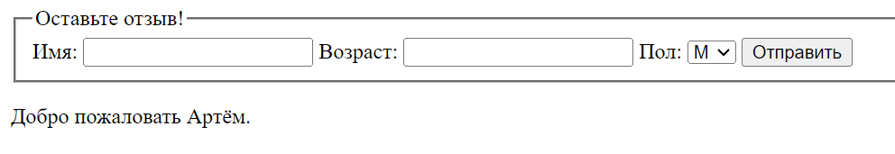

# Отчет по четвертой лабораторной работе

1. [Инструкции по запуску проекта](#1-инструкции-по-запуску-проекта).
2. [Описание проекта](#2-описание-проекта).
3. [Краткая документация к проекту](#3-краткая-документация-к-проекту).
4. [Примеры использования проекта с приложением скриншотов или фрагментов кода](#4-пример-использования-проекта-с-приложением-скриншотов).
5. [Список использованных источников](#5-список-использованных-источников).

## 1. Инструкции по запуску проекта

Данные инструкции действительны при использовании PhpStorm, в ином случае, воспользуйтесь приведенной ссылкой:
[запуск проекта с gitHub](https://www.youtube.com/watch?v=6N6JFynR0gM)

1. Клонируйте репозиторий:
   ```bash
   https://github.com/Artiom9/php_labs.git
2. Запустите проект:
   <!-- Если у вас есть веб-сервер (например, Apache или Nginx), настройте его так, чтобы корневой каталог указывал на
   каталог вашего проекта.  
   Если у вас нет веб-сервера, вы можете использовать встроенный сервер PHP для тестирования: -->
   ```bash 
   php -S localhost:8000 lab_4\lab4.php

## 2. Описание проекта

Эта лабораторная работа охватывает различные аспекты работы с формами в веб-разработке с использованием PHP. Она включает в себя работу с глобальными переменными, такими как $_POST и $_SERVER["PHP_SELF"], обработку и валидацию данных формы, создание собственных функций для валидации, а также изучение различий между глобальными переменными $_POST, $_REQUEST и другими. Задания также включают создание форм с различными элементами управления и обработку введенных данных для вывода результатов. Оно представляет собой комплексное практическое упражнение для понимания основных принципов работы с формами и их обработки в PHP.

## 3. Краткая документация к проекту

```php
<?php
if (!empty($_POST)) {
    if ((int)$_POST['age'] > 18)
        echo '<p>Добро пожаловать ' . $_POST["name"] . '.</p>';
    else
        echo '<p>Вам ещё нет 18, ' . $_POST["name"] . '.</p>';
}

?>
```

## 4. Пример использования проекта (с приложением скриншотов)



## 5. Список использованных источников

1. [Функции в PHP](https://www.php.net/manual/ru/functions.user-defined.php)